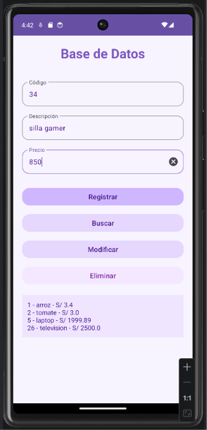
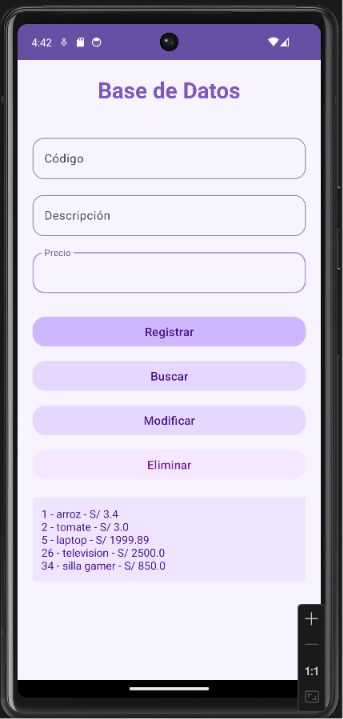
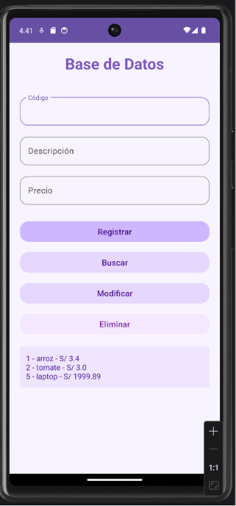

# Ejercicio 3 y 4 - Room + Flow + Repository

Aplicación Android desarrollada en Kotlin usando:

- Room
- SQLite
- Flow
- Repository
- Corutinas
- ViewBinding
- Material Design 3

## Mejoras implementadas

- Actualización en tiempo real con Flow
- Patrón Repository para separar responsabilidades
- CRUD completo con Room

## Capturas

### Ejercicio 3

### Ejercicio 3 Lista

### Ejercicio 4
